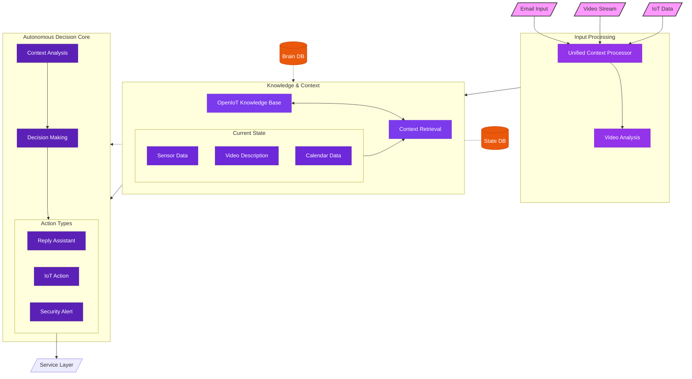

```mermaid

graph TD
    %% Input Sources
    Mail[/"Email Input"/] & Video[/"Video Stream"/] & IoT[/"IoT Data"/] --> InputProc
    
    subgraph InputProcessing["Input Processing"]
        InputProc["Unified Context Processor"]
        VP["Video Analysis"]
        
        InputProc --> VP
    end
    
    subgraph RAGSystem["Knowledge & Context"]
        KB["OpenIoT Knowledge Base"]
        CR["Context Retrieval"]
        
        subgraph State["Current State"]
            SD["Sensor Data"]
            VD["Video Description"]
            CD["Calendar Data"]
        end
        
        KB <--> CR
        State --> CR
    end
    
    subgraph DecisionEngine["Autonomous Decision Core"]
        CA["Context Analysis"]
        DM["Decision Making"]
        subgraph Actions["Action Types"]
            RA["Reply Assistant"]
            IA["IoT Action"]
            SA["Security Alert"]
        end
        
        CA --> DM
        DM --> Actions
    end
    
    %% Flows
    InputProcessing --> RAGSystem
    RAGSystem --> DecisionEngine
    
    %% Output to Services
    Actions --> ServiceLayer[/"Service Layer"/]
    
    %% Data Access
    DB1[(Brain DB)] -.-> RAGSystem
    DB2[(State DB)] -.-> DecisionEngine
    
    classDef input fill:#f9f,stroke:#333,stroke-width:2px
    classDef process fill:#9333ea,stroke:#7e22ce,color:white
    classDef knowledge fill:#7c3aed,stroke:#6d28d9,color:white
    classDef state fill:#6d28d9,stroke:#5b21b6,color:white
    classDef decision fill:#5b21b6,stroke:#4c1d95,color:white
    classDef data fill:#ea580c,stroke:#c2410c,color:white
    
    class Mail,Video,IoT input
    class InputProc,VP process
    class KB,CR knowledge
    class SD,VD,CD state
    class CA,DM,RA,IA,SA decision
    class DB1,DB2 data
```