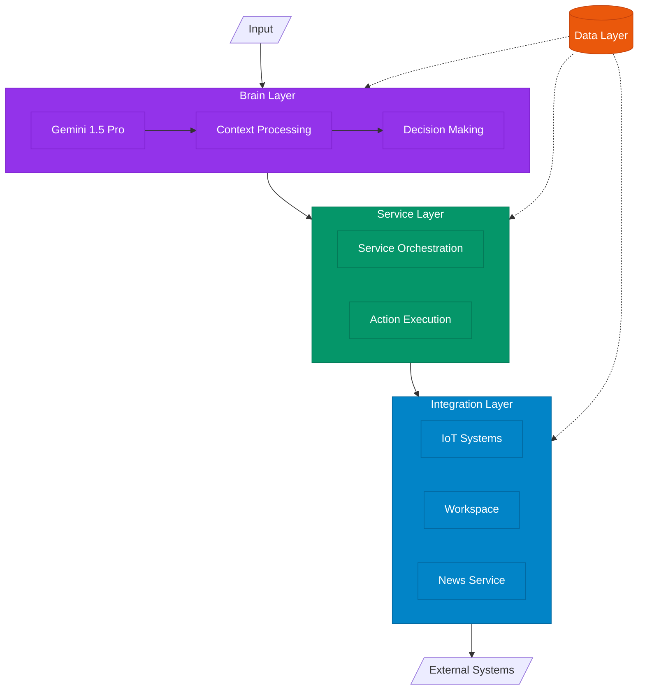

```mermaid
graph TD
    %% Main Flow
    Input[/"Input"/] --> Brain
    
    subgraph Brain["Brain Layer"]
        LLM["Gemini 1.5 Pro"]
        Context["Context Processing"]
        Decision["Decision Making"]
        
        LLM --> Context
        Context --> Decision
    end
    
    subgraph Services["Service Layer"]
        Orchestrator["Service Orchestration"]
        Executor["Action Execution"]
    end
    
    subgraph Integration["Integration Layer"]
        IoT["IoT Systems"]
        Work["Workspace"]
        News["News Service"]
    end
    
    %% Core Flows
    Brain --> Services
    Services --> Integration
    Integration --> External[/"External Systems"/]
    
    %% Data Store
    DB[(Data Layer)] -.-> Brain
    DB -.-> Services
    DB -.-> Integration
    
    classDef brain fill:#9333ea,stroke:#7e22ce,color:white
    classDef service fill:#059669,stroke:#047857,color:white
    classDef integration fill:#0284c7,stroke:#0369a1,color:white
    classDef data fill:#ea580c,stroke:#c2410c,color:white
    
    class Brain,LLM,Context,Decision brain
    class Services,Orchestrator,Executor service
    class Integration,IoT,Work,News integration
    class DB data
```