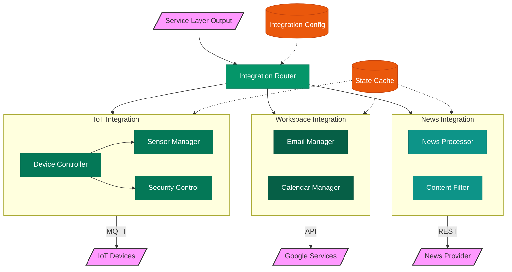

```mermaid
graph TD
    %% Input from Service Layer
    Input[/"Service Layer Output"/] --> Router["Integration Router"]
    
    subgraph IoT["IoT Integration"]
        DC["Device Controller"]
        SM["Sensor Manager"]
        SC["Security Control"]
        
        DC --> SM
        DC --> SC
    end
    
    subgraph Workspace["Workspace Integration"]
        EM["Email Manager"]
        CM["Calendar Manager"]
    end
    
    subgraph News["News Integration"]
        NP["News Processor"]
        NC["Content Filter"]
    end
    
    %% Main Routing
    Router --> IoT
    Router --> Workspace
    Router --> News
    
    %% External Systems Connections
    IoT --> |"MQTT"| Devices[/"IoT Devices"/]
    Workspace --> |"API"| Google[/"Google Services"/]
    News --> |"REST"| NewsAPI[/"News Provider"/]
    
    %% State & Config
    Config[(Integration Config)] -.-> Router
    State[(State Cache)] -.-> IoT & Workspace & News
    
    %% Styling
    classDef router fill:#059669,stroke:#047857,color:white
    classDef iot fill:#047857,stroke:#065f46,color:white
    classDef workspace fill:#065f46,stroke:#064e3b,color:white
    classDef news fill:#0d9488,stroke:#0f766e,color:white
    classDef data fill:#ea580c,stroke:#c2410c,color:white
    classDef external fill:#f9f,stroke:#333,stroke-width:2px

    
    
    class Router router
    class DC,SM,SC iot
    class EM,CM workspace
    class NP,NC news
    class Config,State data
    class Input,Devices,Google,NewsAPI external
```