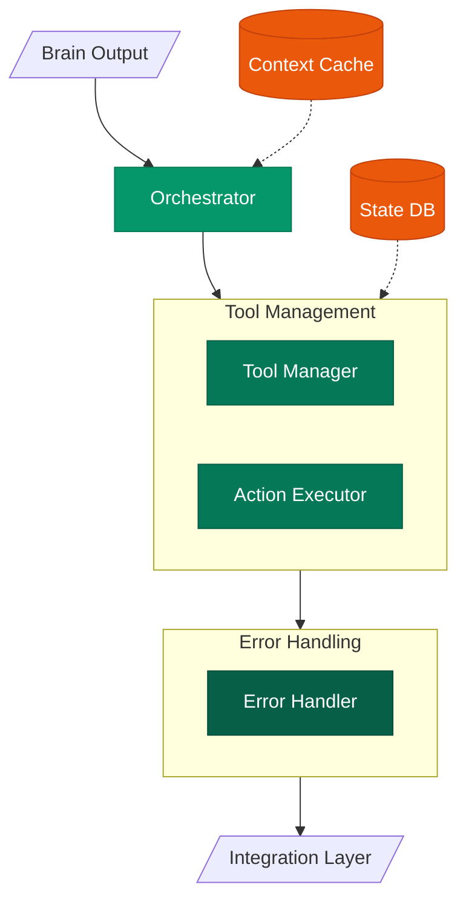

```mermaid

graph TD
    %% Service Components
    Input[/"Brain Output"/] --> Orch["Orchestrator"]
    
    subgraph Tools["Tool Management"]
        TM["Tool Manager"]
        FC["Action Executor"]
    end
    
    subgraph ErrorHandling["Error Handling"]
        EH["Error Handler"]
    
    end
    
    %% Connections
    Orch --> Tools
    Tools --> ErrorHandling
    
    %% Output
    ErrorHandling --> Integration[/"Integration Layer"/]
    
    %% State Management
    Cache[(Context Cache)] -.-> Orch
    State[(State DB)] -.-> Tools
    
    classDef orchestration fill:#059669,stroke:#047857,color:white
    classDef tools fill:#047857,stroke:#065f46,color:white
    classDef error fill:#065f46,stroke:#064e3b,color:white
    classDef data fill:#ea580c,stroke:#c2410c,color:white
    
    class Orch orchestration
    class TM,FC tools
    class EH,Recovery error
    class Cache,State data
```